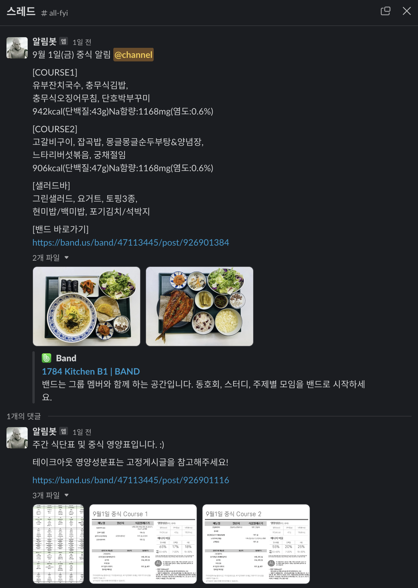

## Naver 1784 식단 알림



<br>

슬랙으로 간편히 1784 구내식당 메뉴를 확인 할 수 있는 봇입니다.<br>

<br>

매일 중식(11:30)/석식(18:00) 알림이 슬랙 채널에 전송됩니다.<br>

<br>

밴드 게시글에 의존하는 서비스이다보니, 전송 시각에 게시글이 올라오지 않으면 해당 시간 기준 +30분까지 1분 간격으로 게시글을 확인하여 슬랙에 전송해줍니다.<br>

<br>

## 사용 방법

### [1. 슬랙봇 설치](./docs/slack-bot.md)

### [2. Band API 설정](./docs/band-api.md)

### [3. 환경 변수 설정](./docs/environment.md)

<br>

위 과정이 모두 완료되면 사용하려는 환경에 맞게(.env, .env.dev, .env.local) 환경 변수 파일을 설정해줍니다.<br>

- 환경 변수 파일은 '/project/env' 경로에 존재합니다.

<br>

`local 환경`

```SHELL
# 로컬 환경에 MySQL Server 설치 및 Database 설정이 완료되어 있어야합니다.

# 의존 라이브러리 설치
$ yarn

# 서비스 실행
$ yarn start:local
```

<br>

`Dev & Prod 환경`

```SHELL
$ docker-compose up --build
```

<br>

---

<br>

이슈 및 버그 사항은 [Issue](https://github.com/GoogGangLabs/1784-today-menu/issues) 남겨주시면 감사합니다.<br>

<br>

Pull Request 및 Issue는 언제나 환영입니다!

<br>


