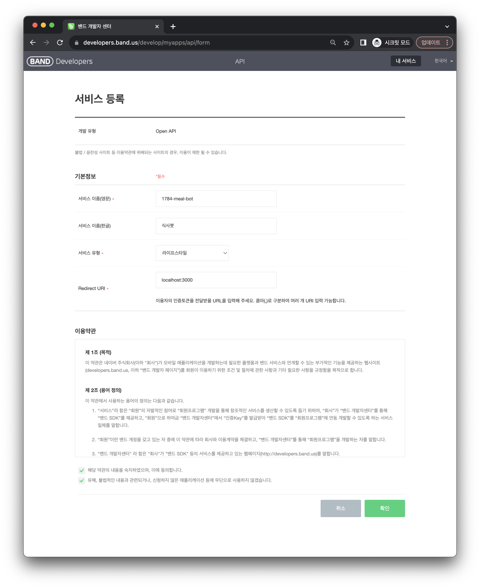
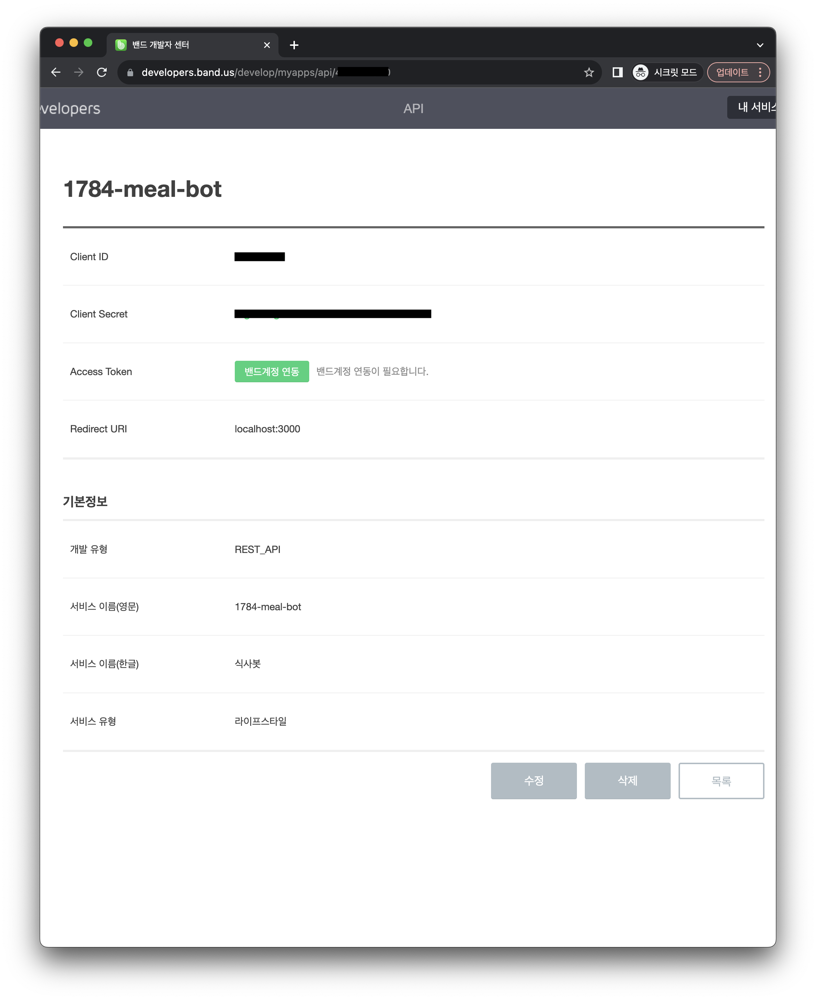
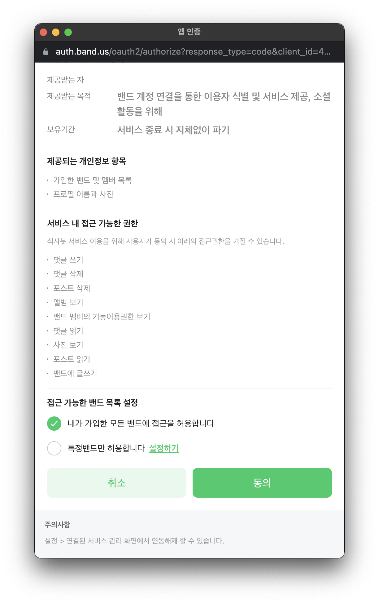
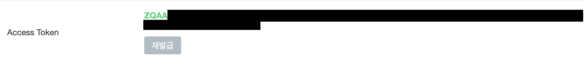

## 밴드 Open API 키 등록

 

1. https://developers.band.us/develop/myapps/list 에 접속합니다.
2. **1784 Kitchen B1** 밴드에 가입된 계정으로 로그인합니다.
3. `내 서비스 등록` 버튼을 클릭합니다.

 

Band API로 사용할 기본 정보를 입력합니다. 

- Redirect URI는 사용하지 않을 예정이나 필수 요소이기 때문에 아무 주소나 입력합니다.

 

이제 `밴드 계정 연동` 버튼을 클릭하여 가입한 밴드의 권한을 부여합니다.

 

**1784 Kitchen B1** 밴드 권한만 허용할 경우 `특정 밴드 허용` > 1784 밴드로 설정합니다.

 

이제 위 Access Token을 환경변수에 사용하시면 됩니다.
