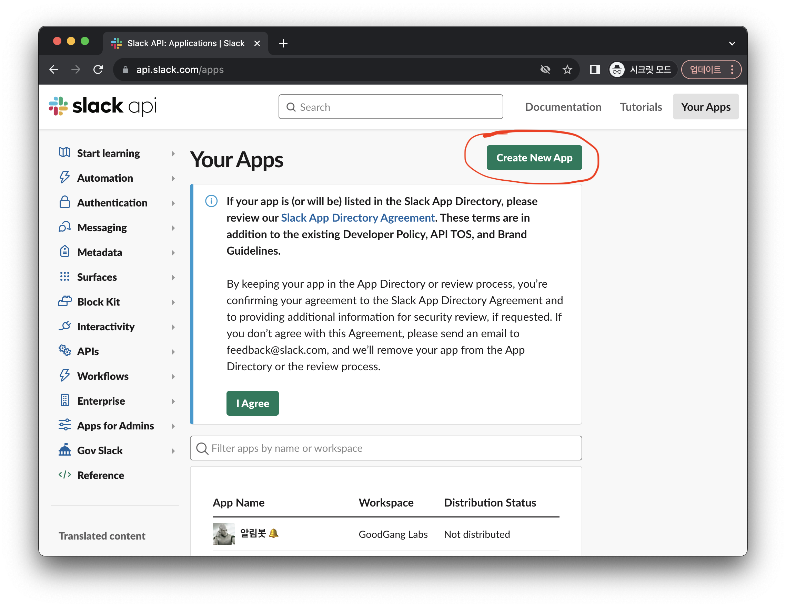
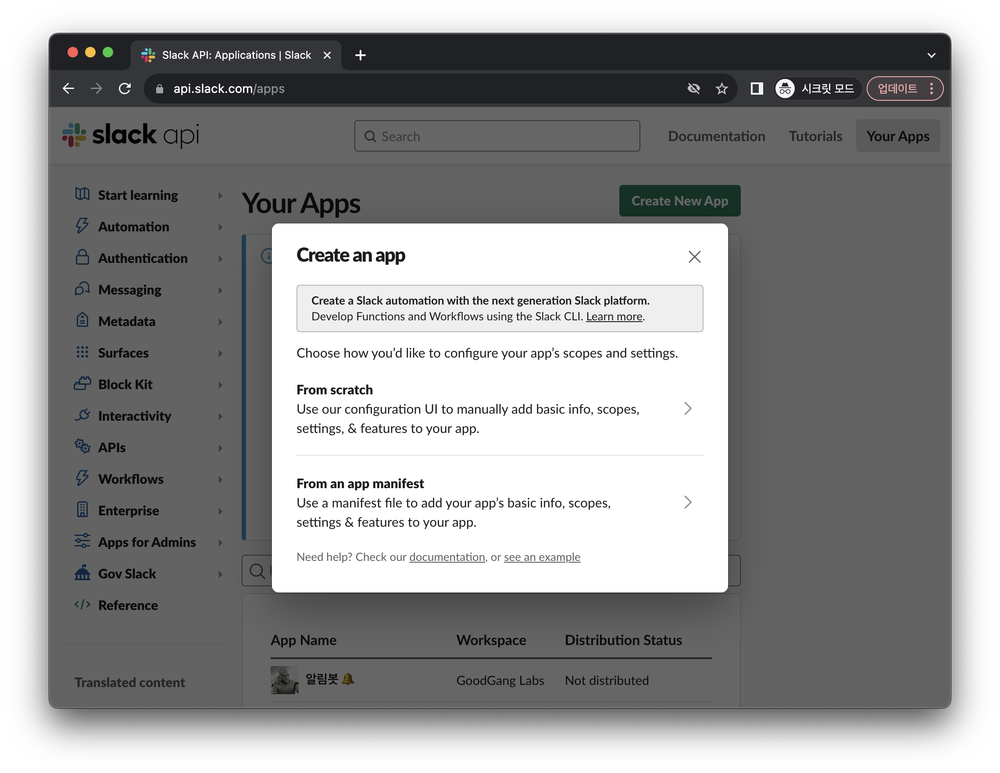
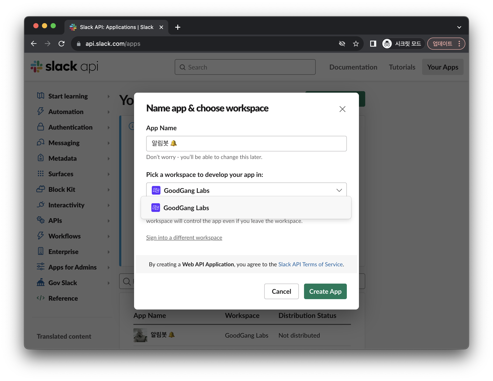
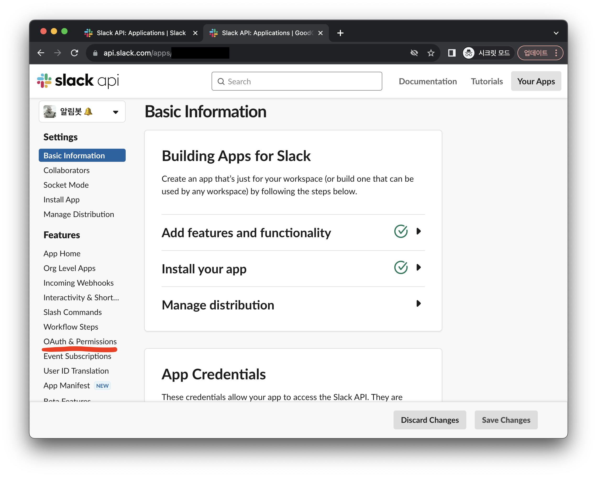
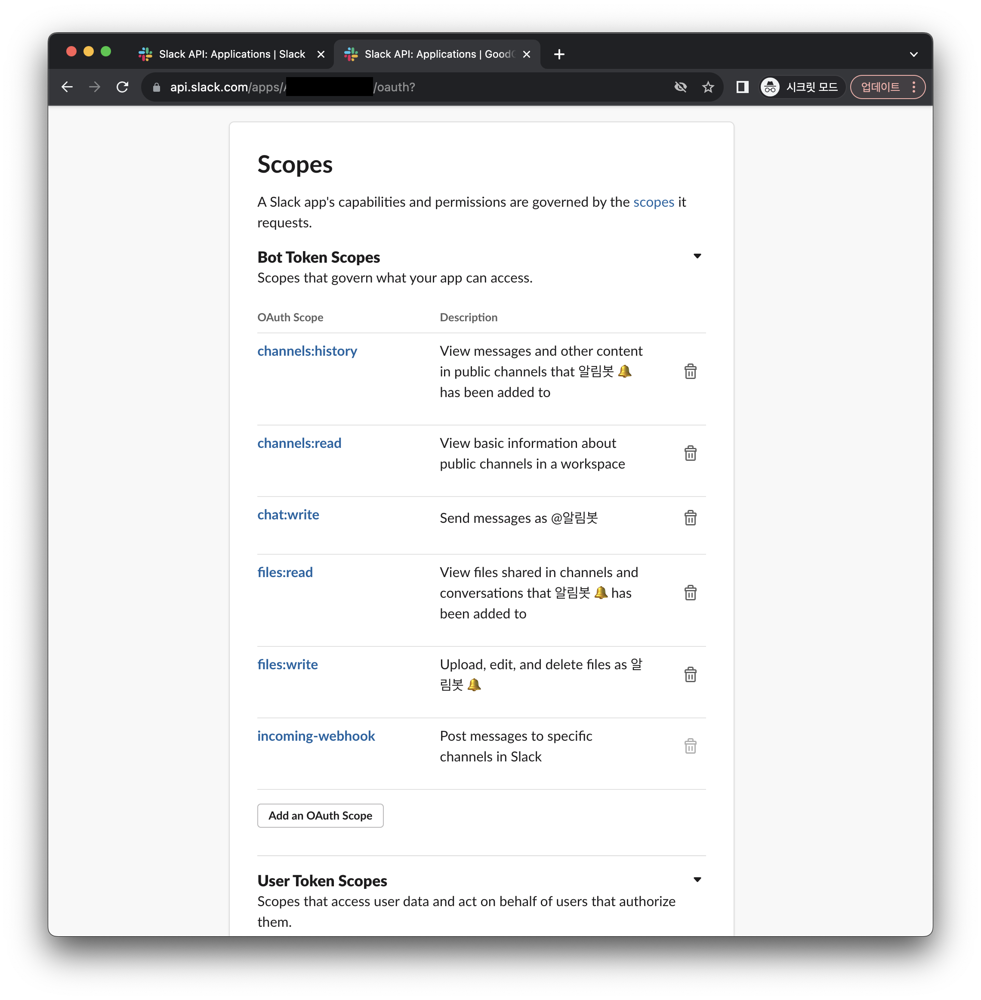
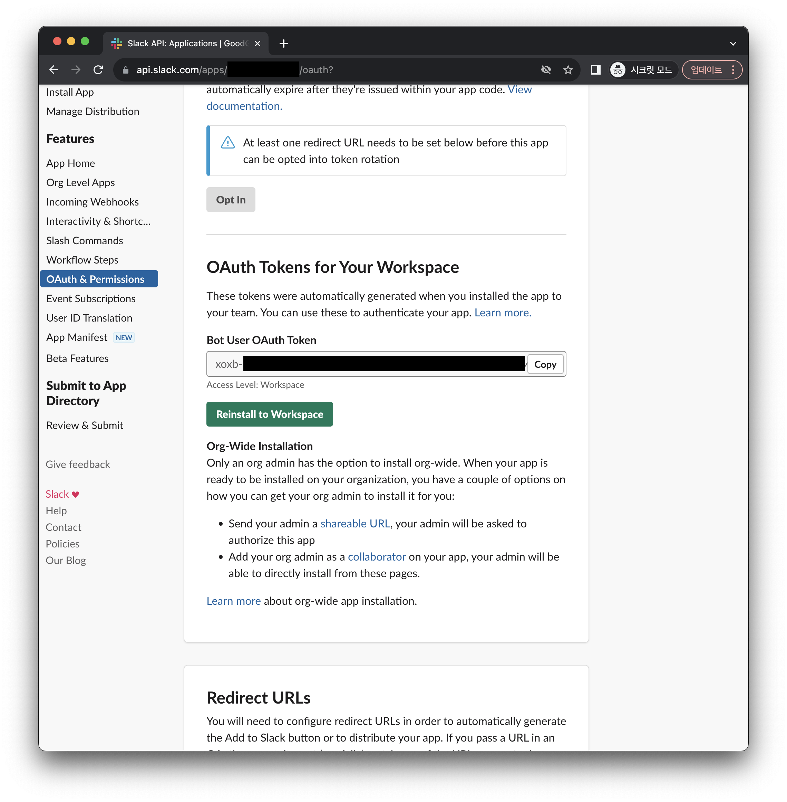
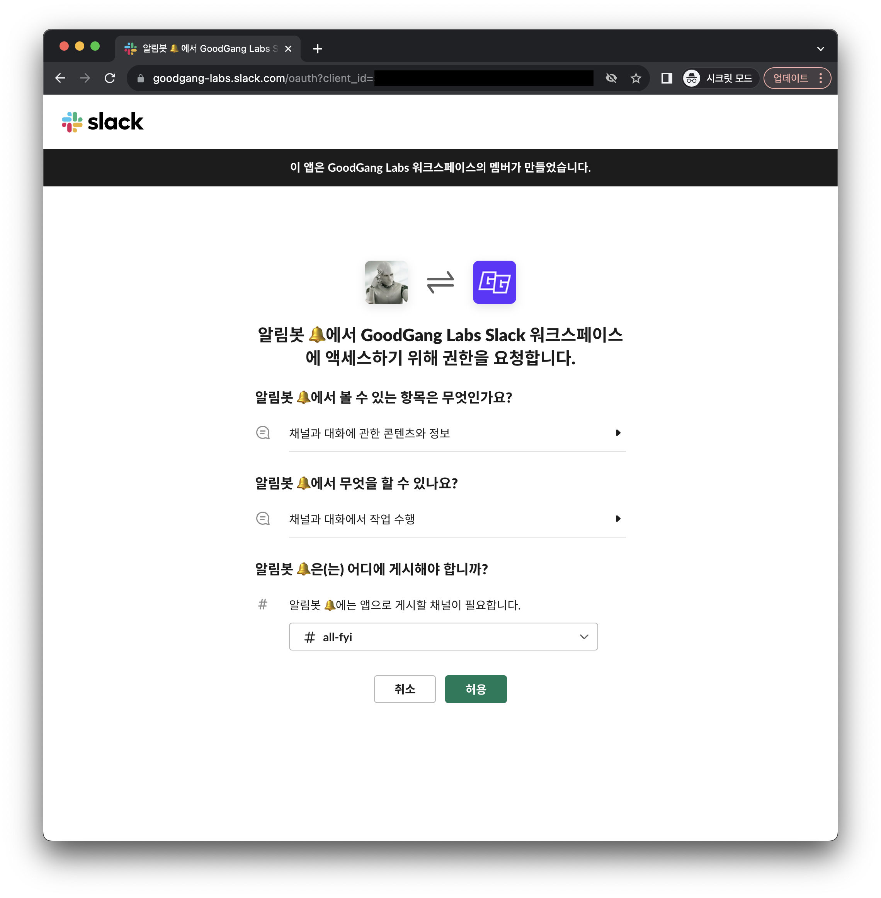
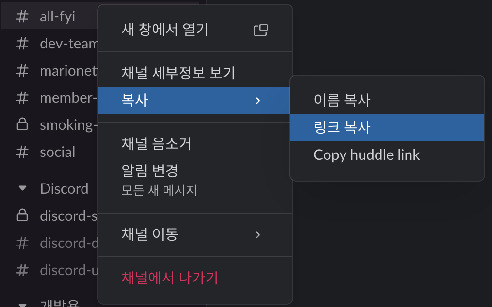

## 슬랙봇 등록 및 권한 설정

 

### 1. 슬랙 API 로그인 및 봇 생성

https://api/slack.com/apps에 접속하여 로그인을 진행해주세요. 
로그인이 완료됐다면, `Create New App` 버튼을 클릭합니다.

- 봇을 구동시키고자 하는 워크스페이스에 가입된 계정으로 로그인 해야합니다.

 

`From scratch`를 클릭합니다. 

 

원하는 봇 이름과 설치할 워크스페이스를 선택해주세요. 

 

### 2. 슬랙봇 권한 설정 및 부여

설치가 완료되었다면, 왼쪽의 `OAuth & Permissions` 탭을 클릭해주세요.

 

중단의 `Scopes` > `Bot Token Scopes` 란에 다음과 같은 권한을 추가해줍니다. 

- channels:history
- channels:read
- chat:write
- files:read
- files:write

 

이제 봇을 워크스페이스에 설치해 줄 차례입니다! 
이미 설치되어있는 봇이라 Reinstall to Workspace 버튼이 보이지만, 처음 설치하는 경우 `Install to Workspace` 버튼이 보일 것입니다. 

- `xoxb-`로 시작하는 Token은 해당 프로젝트의 환경 변수로 쓰이는 토큰이니 따로 저장해두면 좋습니다. 😊

 

원하는 채널을 선택 후 `허용` 버튼을 클릭하면 완료됩니다!

 

### 3. 채널 ID 확인

이제 슬랙으로 돌아가 봇을 설치한 채널 ID를 구할 차례입니다. 
해당 채널을 우클릭 > 복사 > 링크 복사합니다. 

 

그럼 아래와 같은 링크가 복사되는데 

- https://your-workspace.slack.com/archives/C0123123

해당 링크의 'archives/' 뒤 C로 시작하는 문자열이 Channel ID입니다.

 

이제 위에서 구한 [Bot Token](#2-슬랙봇-권한-설정-및-부여)과 [Channel ID](#3-채널-id-확인)를 환경 변수로 사용하면 됩니다. 
